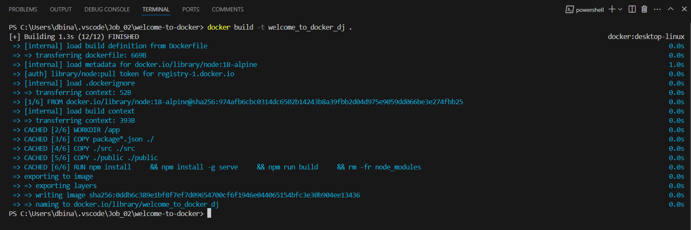
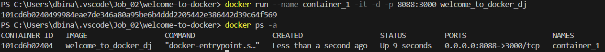
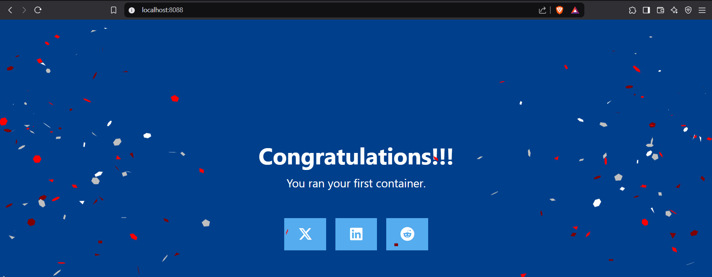
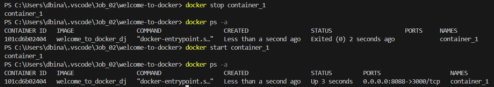
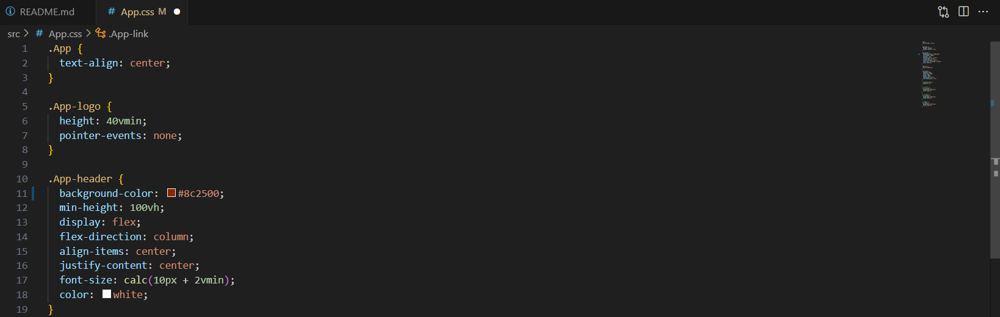
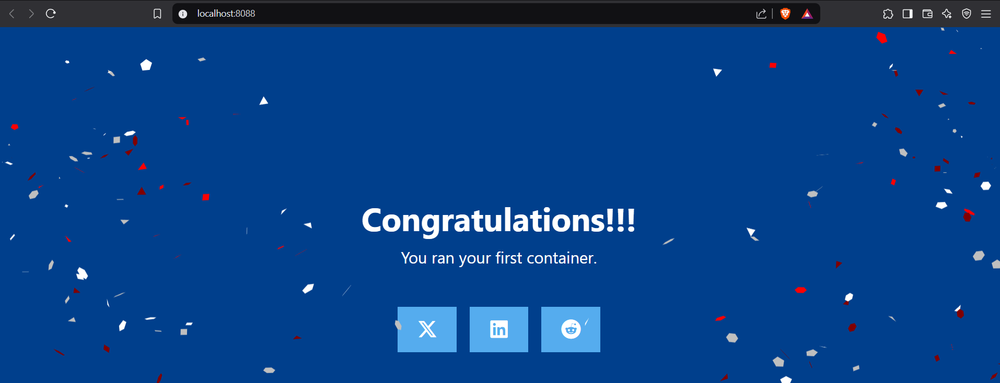
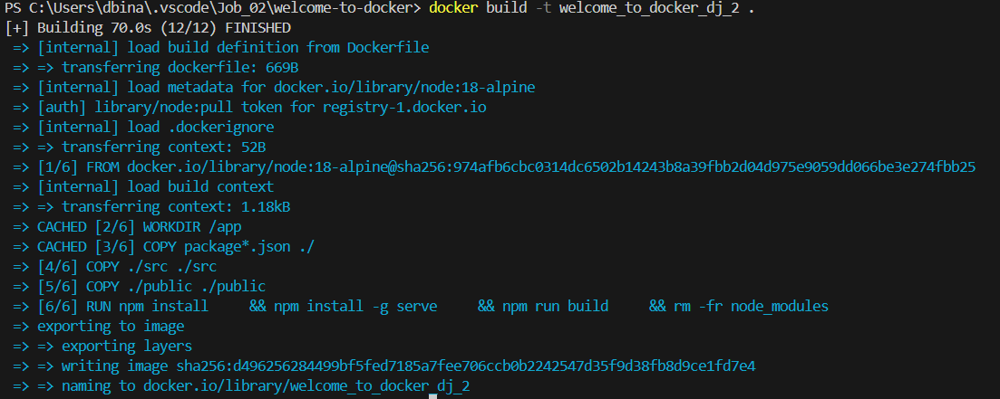
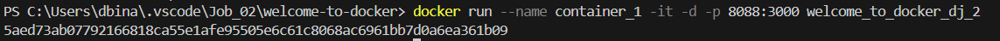
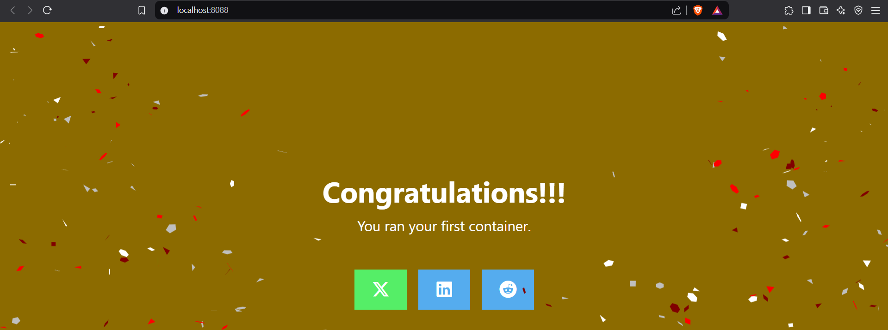

# Runtrack Job 02 : Docker

```sh
We can open vscode's terminal using the "view" window on the top left side or by pressing the "CTRL+ù" command
```


```sh
ls
```

When we want to list files and directory in our current location we use this command, it allows us to see all of them. 


```sh
cd
```

The `cd` command can be used in many ways to acces files, one of which is to access those who are in current location. 
Here, we start from the location "C:\Users\dbina\.vscode\Job_02" in which we can see using `ls` a file named welcome-to-docker . We access it simply by writing the file name after the command. 


There are multiple files in the "WELCOME-TO-DOCKER" folder. Let's take a look at them :


```sh
.dockerignore 
```
It's a plain text file used by Docker to specify files and/or directories that should be ignored when building an image. It presents itself like so in ours :

 

 ```sh
 .gitignore
 ```

 This file is tailored for Node.js and JavaScript/TypeScript projects. 
 A `.gitignore` file tells Git which files and directories to ignore, so they won't be tracked or committed in a repository.
 It can keep the repository clean by avoiding unnecessary files, Improves performance by skipping temporary/cache files.. Among other things. 

 

 ```sh
 Dockerfile
 ```

 A Dockerfile is a script that contains a set of instructions to automate the creation of Docker images. It defines how it should be built, configured, and run.

 


```sh
docker build -t <my-image-name> .
```
`docker build` starts the image building process while `-t` names the image. The dot `.`means that the command will use the Dockerfile in this directory. 



```sh
Creating a container and making sure it's running with the correct Docker image as well as checking the port with my browser. 
```







```sh
Trying to apply change to the code
```

Trying to apply change to the code doesn't work in real time because the container is still using the outdated version. Applying changes after the image was created won't modify anaything. 

Here is an exemple when trying to change the background to orange and changes don't happen : 





```sh
Creating a new image and running a new container with it after we applying changes.
```
Now that we did it in the right order, we can see our new beautiful background !





