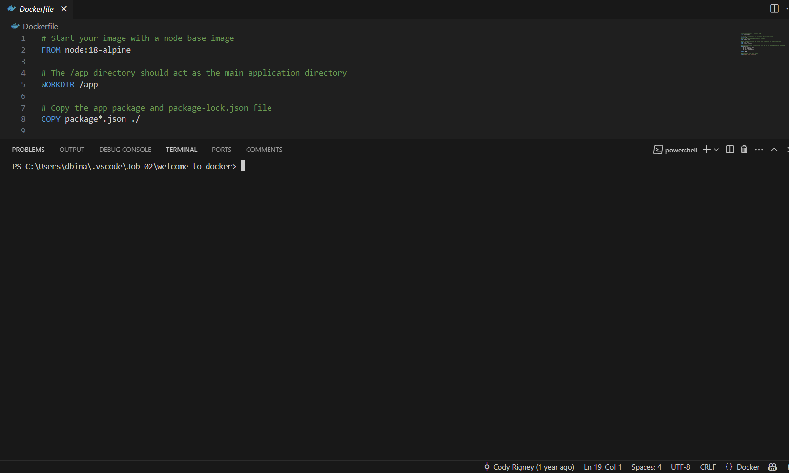
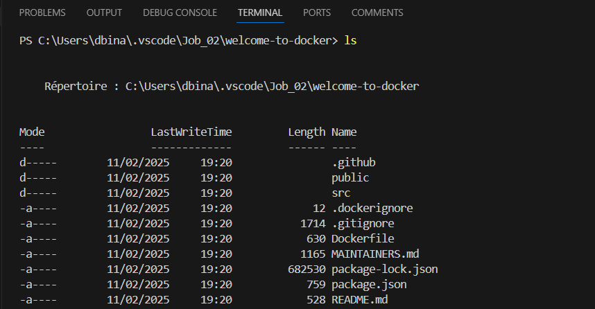
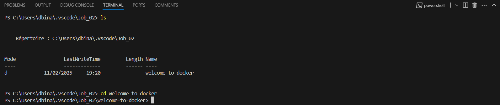
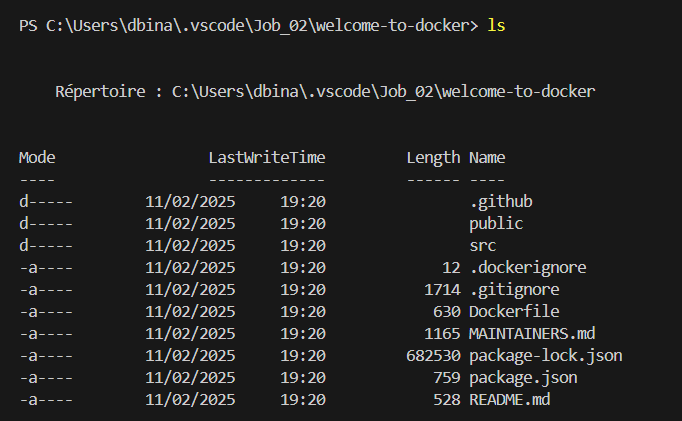
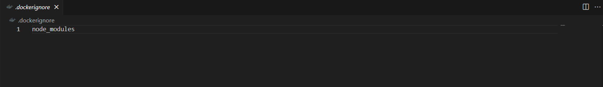
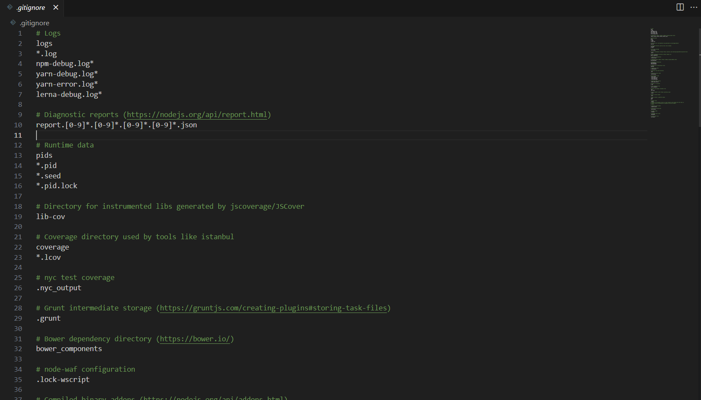
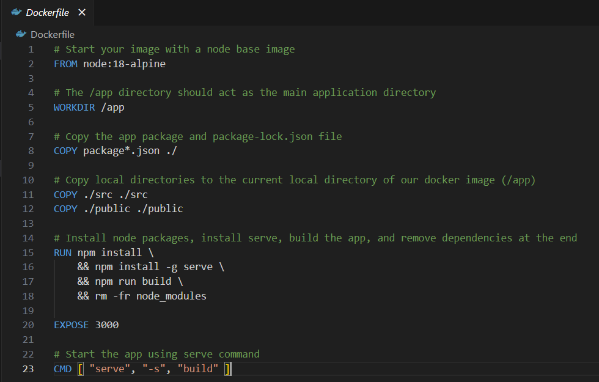

# Runtrack Job 02 : Docker

```sh
We can open vscode's terminal using the "view" window on the top left side or by pressing the "CTRL+ù" command
```



```sh
ls
```

When we want to list files and directory in our current location we use this command, it allows us to see all of them. 



```sh
cd
```

The `cd` command can be used in many ways to acces files, one of which is to access those who are in current location. 
Here, we start from the location "C:\Users\dbina\.vscode\Job_02" in which we can see using `ls` a file named welcome-to-docker . We access it simply by writing the file name after the command. 



There are multiple files in the "WELCOME-TO-DOCKER" folder. Let's take a look at them :



```sh
.dockerignore 
```
It's a plain text file used by Docker to specify files and/or directories that should be ignored when building an image. It presents itself like so in ours :

 

 ```sh
 .gitignore
 ```

 This file is tailored for Node.js and JavaScript/TypeScript projects. 
 A `.gitignore` file tells Git which files and directories to ignore, so they won't be tracked or committed in a repository.
 It can keep the repository clean by avoiding unnecessary files, Improves performance by skipping temporary/cache files.. Among other things. 

 

 ```sh
 Dockerfile
 ```

 A Dockerfile is a script that contains a set of instructions to automate the creation of Docker images. It defines how it should be built, configured, and run.

 

