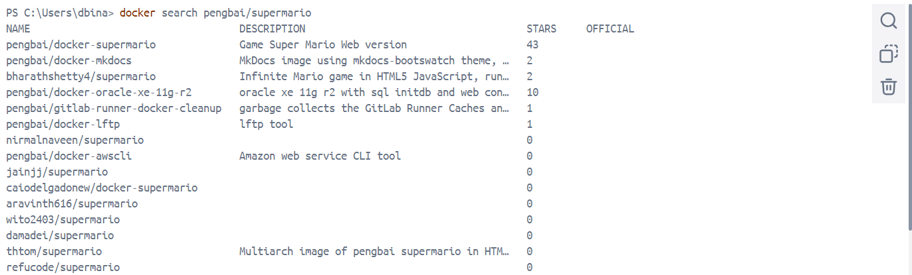
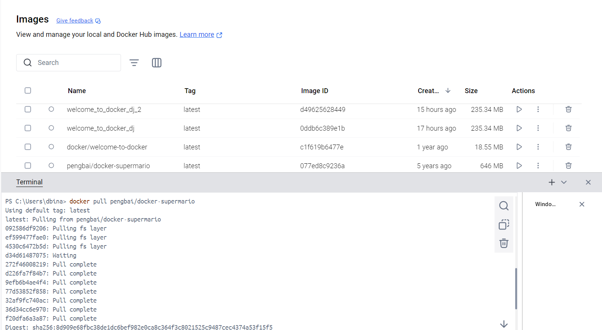

# Runtrack Job 03 : Docker

```sh
docker search
``` 
We start by using this command to search for the name of the image in Docker Hub like so :



```sh
docker pull
```

We can then pull our image since we now know its exact name .The one we are interested in is on top of the list. 
It gracefully places itself in our file of local and Docker Hub images. 



Another method would be to retrieve it by using Docker Desktop search engine. 

