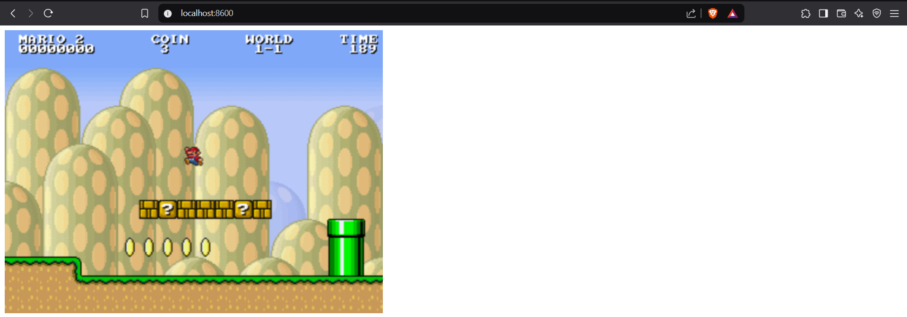

# Runtrack Job 03 : Docker

```sh
docker search
``` 
We start by using this command to search for the name of the image in Docker Hub like so :


```sh
docker pull
```

We can then pull our image since we now know its exact name .The one we are interested in is on top of the list. 
It gracefully places itself in our file of local and Docker Hub images. 


Another method would be to retrieve it by using Docker Desktop search engine. 


```sh 
docker run
```

Now to run this image we can either use our command with the terminal or do it manually with Docker Desktop.

Exemple with command : 


Exemple with Docker Desktop built in feature :

First we need to go to our list of images and find the one we want to run. 
Once we find it, click on the "play" icon.


This window appears and we apply our wanted optional settings :


Once we are done and click on "run" it should appear in our containers list :


To acces the container, we just need to open our browser and use our port as a link : 


We can now play super mario on our browser ! 




```sh
docker ps
```

To find our container's ID, we can either use the `docker ps` command : 

