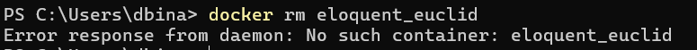
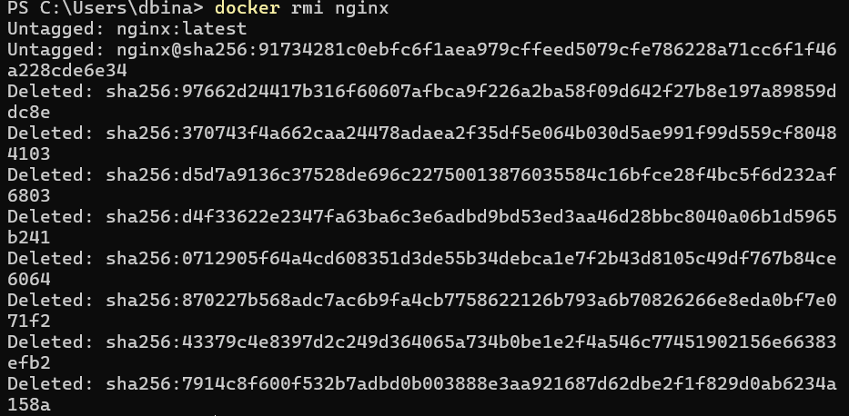

# Runtrack jour 01 : Docker

```sh
docker version
```
This command allows us to check which version of docker we're using.


```sh
docker info
```
Displays system wide information regarding the Docker installation 


```sh
docker ps
```
Provides a list of containers on your machine as well as their specific state (running or not, size..)


```sh
docker images
```
Displays a list of the images you pulled and their satuts.


```sh
docker run
```

Starts a new container and executes a command inside it, it pulls an image if needed. 


```sh
docker stop
```
Stops one or more running containers.


```sh
docker pull
```
The "docker pull" command downloads a Docker image locally on the host from a public or private registry. Here we pulled nginx's latest image version using the ":latest" option.


```sh
docker images
```
As said previously, this command displays all of your images. Since we pulled nginx's image, we can see where it's saved locally, which version we're using, its ID, when it was created and how much space it takes. 


```sh
docker run <image_name>
```

Using docker run to create container for nginx's image. `-it`option allows to run the container interacively. `-i` for interactive mode and `-t` for accessing terminal. This can be useful if the image you're running is an OS for exemple.

  ```--rm``` option makes it so this container will be deleted if stopped. 

  `-p` is used to assign a port for your image.


```sh
Access container using an explorer
``` 
To acces your container using an exploreur, we use the port we assigned it as an url in the search tab.


```sh
docker stop <container_name>
```
This command allows us to stop a running container with its name. We can use the `docker ps` command to retrieve the name of the container and then use it.


```sh
docker rm <container_name>
```

Deletes a specific container. Here as we used the `--rm` option creating the container, it was deleted when stopped. We get an error message as it no longer exists.



```sh
docker rmi <image_name>
```

This command deletes a specific image. Here we delete nginx's image.

